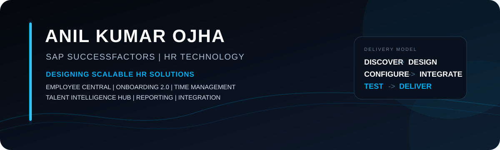

 

  

---

<h2 align="center">SAP SUCCESSFACTORS | HR TECHNOLOGY | SOLUTION DELIVERY</h2>

I design, configure and deliver practical HR technology solutions across the SAP SuccessFactors ecosystem.

 

<table>
<tr>
<td width="50%" valign="top">

### CORE EXPERTISE

**Employee Central**
 Core HR | Job Information | Data Models | MDF | Business Rules | Workflows | RBP

 

**Onboarding 2.0**
 New Hire | Rehire | Forms | Compliance | Documents | Integrations | Reporting

 

**Time Management**
 Time Off | Time Profiles | Holidays | Work Schedules | Accruals | Proration | Take Rules

</td>
<td width="50%" valign="top">

### TALENT AND ANALYTICS

**Talent Intelligence Hub**
 Skills | Skills Graph | Attributes | Talent Capabilities

 

**Reporting and Analytics**
 Story | Canvas | People Analytics | Operational Reporting

 

**Integration and Automation**
 Integration Center | APIs | SFTP | Data Validation | HR Automation

</td>
</tr>
</table>

---

## SOLUTION ARCHITECTURE

<strong>Requirement discovery to production delivery, with maintainability and operational impact in mind.</strong>

---

## WHAT I SOLVE

<table>
<tr>
<td width="33%" valign="top">

### HR PROCESS DESIGN

- Hire and Rehire
- Employee lifecycle
- Time Off frameworks
- Eligibility and validations
- Compliance workflows

</td>
<td width="33%" valign="top">

### RULES AND SECURITY

- Complex Business Rules
- Accrual logic
- Seniority and proration
- RBP design
- Target Groups
- Workflow routing

</td>
<td width="33%" valign="top">

### DATA AND INSIGHTS

- Story Reports
- Canvas Reports
- People Analytics
- Integration Center
- Power BI datasets
- Operational dashboards

</td>
</tr>
</table>

---

## TECHNOLOGY STACK

  

  

---

## SELECTED SOLUTION AREAS

| DOMAIN | SOLUTION FOCUS |
|:---|:---|
| **Employee Central** | Core HR, Job Information, MDF, Rules, Workflows, RBP |
| **Onboarding 2.0** | New Hire, Rehire, Forms, Compliance, Documents, Integrations |
| **Time Off** | Accruals, Seniority, Proration, Eligibility, Holidays, Take Rules |
| **Talent Intelligence** | Skills, Skills Graph, Attributes, Talent Capabilities |
| **Reporting** | Story, Canvas, People Analytics, Operational Reporting |
| **Integration** | Integration Center, APIs, SFTP, Downstream Data |

---

## CURRENT FOCUS

---

## GITHUB ACTIVITY

  

---

## EXPLORE MY WORK

  

---

### ANIL KUMAR OJHA

**SAP SuccessFactors Consultant | HR Technology | Solution Delivery**

